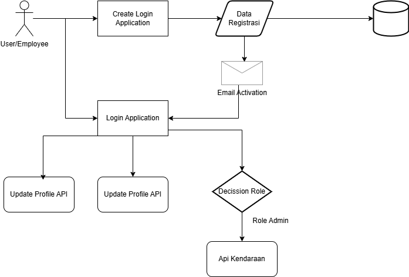

# Project Vehicle for Backend Engineering

## Description

This project is a simple and responsive for application vehicle and each user separate by role of user and each user can create, update and delete their account daily tasks efficiently and create activation through the email user.

## Feature

### Account

- User Account Create
- User Account Update
- User Account Activation
- User Account Deactivate

### Vehicle

- Vehicle Create
- Vehicle Update
- Vehicle Delete

### file

- File for Profile User
- Delete File

### Message

- Create A Message

## Flow Diagram Case

